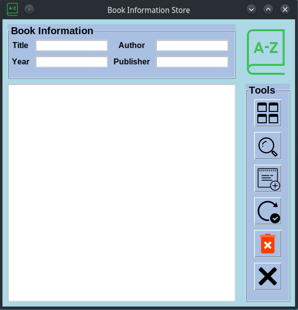

# BOOK INFO STORE

 You can add books information and save it in database. 

 Filter/Search them by: Title, Author, Year, or Publisher. 

 Also view, update and delete records. 

## Tools

 1. View All 

 2. Search 

 3. Add Entry 

 4. Update Entry

 5. Delete Entry

 6. Close 

# GUI IMAGE
</img>